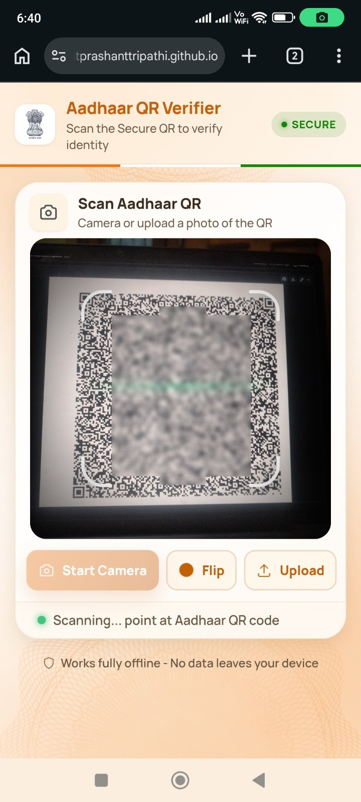
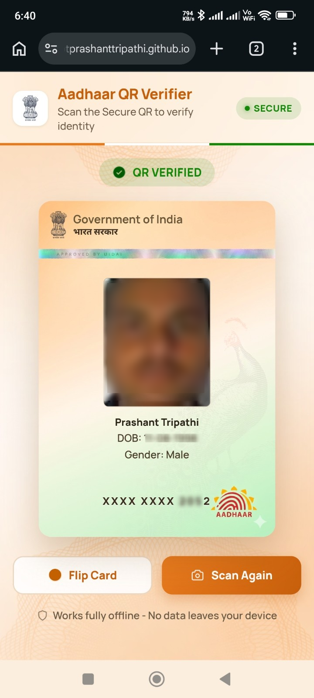
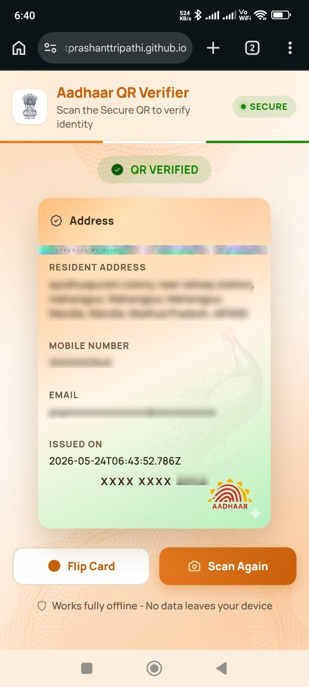

<!-- ─────────────────────────────────────────────────────────────────────────
     README.md — Aadhaar QR Code Reader
     @author  Prashantt Tripathi <https://github.com/PtPrashantTripathi>
     ───────────────────────────────────────────────────────────────────────── -->

<div align="center">


# 🇮🇳 Aadhaar QR Code Reader

**Scan the Secure QR on any Aadhaar card to instantly verify identity details —
100 % offline, no server, no data leaves your device.**

[](https://github.com/PtPrashantTripathi/AadhaarQRCodeReader/actions/workflows/pages.yml)


</div>

---

## ✨ Features

| Feature | Details |
|---|---|
| 📷 Live camera scan | Uses the rear camera on mobile, front on desktop |
| 🖼️ Image upload | Pick any photo containing an Aadhaar QR from your gallery |
| 🔒 100 % offline | All decoding happens in the browser — zero network requests |
| 🪪 Full card details | Name, DOB, gender, address, mobile last-4, email (if present), issue date |
| 🃏 3D card flip | Front (personal) ↔ Back (address) card flip animation |
| 🔗 Shareable URL | Result is encoded in `?data=` so links can be bookmarked |
| 📱 Mobile-first | Works on iOS Safari, Android Chrome, and desktop browsers |

---

## 📸 Screenshots

<div align="center">

| Scanner | Verified Result (Front) | Verified Result (Back) |
|:---:|:---:|:---:|
|  |  |  |
| Point camera at any Aadhaar QR | Personal details on the front face | Address & reference date on the back |

</div>

---

## 🚀 Getting Started

### Option 1 — GitHub Pages (live demo)

Open the live deployment in your browser — no install needed:

```
https://PtPrashantTripathi.github.io/AadhaarQRCodeReader/
```

### Option 2 — Run locally

```bash
# 1. Clone the repository
git clone https://github.com/PtPrashantTripathi/AadhaarQRCodeReader.git
cd AadhaarQRCodeReader

# 2. Serve with any static server (the app uses ES Modules, so file:// won't work)
npx serve .
# — or —
python3 -m http.server 8080

# 3. Open http://localhost:8080 in your browser
```

> **Why a server?** ES Module `import` statements require `http://` or `https://`.
> Opening `index.html` directly via `file://` will fail with a CORS error.

---

## 🔍 How to Use

### Scanning with camera

1. Open the app in your browser.
2. Tap **Start Camera** — grant camera permission when prompted.
3. Point the rear camera at the **Secure QR code** printed on an Aadhaar card
   or letter (the large QR, not the small one).
4. Hold steady — the green scan line detects the code automatically.
5. The app redirects to `?data=…` and shows the **verified card** result.
6. Tap **Flip Card** to toggle between personal details and the address.
7. Tap **Scan Again** to return to the scanner.

### Scanning from an image

1. Tap **Upload** instead of Start Camera.
2. Select any photo (gallery, screenshot, scanned document) that contains the
   Aadhaar Secure QR.
3. The app analyses the image instantly and shows the result.

### Using the `?data=` URL

If you already have the raw QR string (base-10 decimal), append it to the URL:

```
https://PtPrashantTripathi.github.io/AadhaarQRCodeReader/?data=<qr-value>
```

The page will decode and render the card without opening the camera.

---

## 🏗️ Project Structure

```
AadhaarQRCodeReader/
├── index.html                   # App shell
├── css/
│   ├── base.css                 # Design tokens, layout, typography
│   └── components.css           # Scanner, card, buttons, animations
├── script/
│   ├── main.js                  # App entry point, view orchestration
│   ├── modules/
│   │   ├── aadhaar.js           # Aadhaar Secure QR decoder (gzip + fields)
│   │   ├── camera.js            # Camera controller & file-upload QR scan
│   │   └── jpeg_decoder.js      # JPEG 2000 photo decode via openjpeg WASM
│   └── utils/
│       ├── bytes.js             # decimalToBytes, gunzip
│       ├── dom.js               # setStatus (status-bar helper)
│       └── format.js            # formatAadhaarNumber, extractComment
├── images/                      # Icons, card backgrounds, emblems
├── .github/
│   └── workflows/
│       └── pages.yml            # GitHub Pages CI/CD deployment
├── .gitignore
└── README.md
```

---

## 🔐 Privacy & Security

- **No network calls** — the app makes zero requests after the initial page load.
- **No storage** — nothing is written to `localStorage`, `sessionStorage`, or
  cookies.
- **Client-side only** — all decoding (gzip, field parsing, JPEG 2000) happens
  in the browser using Web APIs and WebAssembly.
- The `?data=` URL parameter contains the raw QR payload — treat it like the
  physical card (don't share publicly).

---

## 🛠️ Tech Stack

| Library | Purpose | Loaded from |
|---|---|---|
| [jsQR](https://github.com/cozmo/jsQR) | QR code detection from pixel data | jsDelivr CDN |
| [openjpeg.js](https://github.com/kripken/j2k.js) | JPEG 2000 decode (Emscripten) | jsDelivr CDN |

No build tools, no frameworks, no transpilation — vanilla ES Modules.

---

## 📄 License

GNU GPL3 © [Prashantt Tripathi](https://github.com/PtPrashantTripathi)

---

<div align="center">

Made with ❤️ by [@PtPrashantTripathi](https://github.com/PtPrashantTripathi)

</div>
